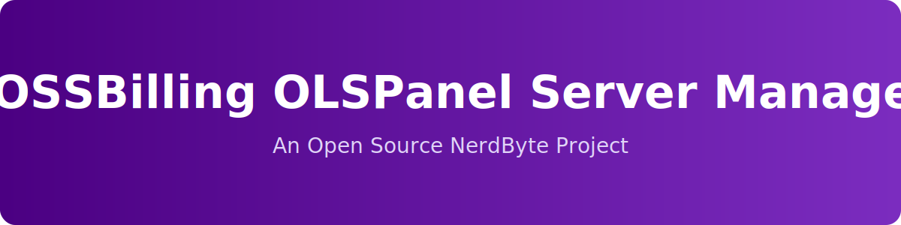

<!-- NerdByte Branding -->

  

  

  
  
  
  
  
  
  
  

---

# FOSSBilling OLSPanel Server Module

An open source server management module that integrates **OLSPanel** with **FOSSBilling**, enabling automated hosting account provisioning and lifecycle management.

This project is **community-developed and maintained** by NerdByte and is not officially affiliated with OLSPanel or FOSSBilling.

---

## About This Project

The FOSSBilling OLSPanel Server Module provides a clean and maintainable integration between OLSPanel-powered hosting servers and the FOSSBilling automation platform.

It allows hosting providers and developers to provision and manage customer accounts directly from within FOSSBilling while leveraging the performance and flexibility of OLSPanel.

The goal of this project is to provide:

- A lightweight and reliable integration
- Clear, maintainable code structure
- Predictable automation behavior
- Extensibility for future enhancements

---

## Features

The module currently supports:

- ✅ Provision new users and domains  
- ✅ Suspend accounts  
- ✅ Unsuspend accounts  
- ✅ Change account passwords  
- ✅ Cancel and permanently delete accounts  

Additional improvements and refinements are released incrementally.

---

## Installation

1. Download the `OLSPanel.php` file from this repository.
2. Copy the file to your FOSSBilling installation: `/library/server/manager/OLSPanel.php`
3. Log in to the FOSSBilling Admin Panel.
4. Navigate to **System → Servers**.
5. Create a new server using the **OLSPanel** server manager.
6. Configure authentication and connection details as required.

---

## Requirements

- PHP **8.1 or higher**
- FOSSBilling **0.5 or higher**
- Active OLSPanel server instance
- Valid OLSPanel administrative credentials

---

## Required Custom Package Configuration

The following custom parameters must be defined for each product in FOSSBilling:

- **pkg_id**  
The Package ID from OLSPanel.

- **php_version**  
The PHP version assigned to the package (e.g., `8.1`, `8.2`).

Location in FOSSBilling: `Products → Edit Product → Custom Parameters`

---

## How to Locate the Package ID in OLSPanel

To retrieve the correct `pkg_id`:

1. Log in to your **OLSPanel Admin Panel**.
2. Navigate to **Users → Package**.
3. Click **Manage** on the desired package.
4. Review the browser URL. It will look similar to:
5. The final number in the URL is the **Package ID**.

Example:  
If the URL ends in `/1/`, then: `pkg_id = 1`

Ensure:
- `yourolspaneldomain` matches your server hostname or IP
- `panelport` matches your configured OLSPanel port

---

## Disclaimer

FOSSBilling OLSPanel Server Module is an independent open source project developed by NerdByte.

It is **not affiliated with, endorsed by, or sponsored by**:

- OLSPanel  
- FOSSBilling  

All trademarks and product names are the property of their respective owners.

---

## Support the Project

If this project helps you, consider supporting continued development.

Support is always appreciated — but never required.

---

## Star History

---

  <strong>NerdByte</strong> 
  Building tools for builders.

